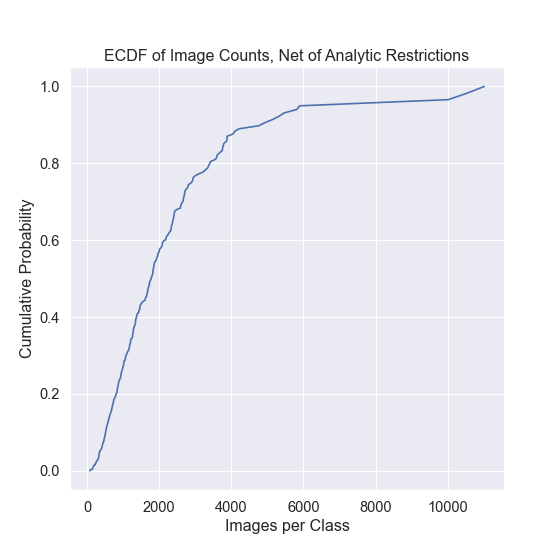

# Introduction
*TODO*

# Training Data
### Dataset construction
To create a representative sample of vehicle make and model images for the U.S. passenger vehicle market we rely on the [back4app.com](https://www.back4app.com/database/back4app/car-make-model-dataset) database, an open-source dataset providing detailed information about motor vehicles manufactured in the US between the years 1992 and 2022. A local copy of this database are stored locally at `./create_training_images/make_model_database.csv` along with the script to generate this extract at `./create_training_images/get_make_model_db.py`. At the time the data were queried, this database contained information on vehicles up through and including 2022 models, though 2022 models are only available for some manufacturers. The database contained information on 59 distinct vehicle manufacturers and 1,032 detailed make-model combinations over the period. 

We drop 4 small vehicle manufacturers (e.g. Fisker, Polestar, Panoz, Rivian), 8 exotic car manufacturers (e.g. Ferrari, Lamborghini, Maserati, Rolls-Royce, McLaren, Bentley, Aston Martin, Lotus), and 7 brands with sparse information in the dataset (e.g. Alfa Romeo, Daewoo, Isuzu, Genesis, Mayback, Plymouth, Oldsmobile), reducing the number of distinct vehicle manufacturers in the data to 40. 

To reduce the number of vehicle make-model combinations, related detailed vehicle models are combined together (e.g. Ford F-150 Super Cab and Ford F350 Super Duty Crew Cab are combined into a single Ford F-Series category) using the script at `./create_training_images/restrict_population_make_models.py`. This reduced the number of unique make-model combinations over the period to 574. The restricted vehicle database is stored at `./create_training_images/make_model_database_mod.csv` with a corresponding analysis of this database in `./create_training_images/back4app_database_analysis.ipynb`. A full list of these 574 make-model classes can be found below.

Having defined the population of vehicles of interest, we scrape Google Images to download images that will be used as our training dataset. To capture sufficient variation *within* each vehicle make-model combination over time we scrape images using the detailed vehicle model descriptor, combined with the vehicle category (e.g. coupe, sedan, hatchback, SUV, comvertible, wagon, van, pickup), for every year available. In told, this produced 8,274 unique make-(detailed-)model-category-year combinations.
 
For every make-(detailed-)model-category-year combination, we scrape 100 images, which typically results in 85-90 savable PNG or JPG images. We store these data in separate directories on disk based on make-(aggregated-)model-year. In each directory, approximately 95% of saved images are exterior vehicle photographs with the vast majority corresponding to the correct vehicle make, model and year. 

## Descriptives

A full analysis of the scraped image dataset can be found under `./create_training_images/scraped_image_analysis.ipynb`. 690,014 total images were scraped for all 574 make-model classes over the period. Of these, 531,599 (77.04%) images were identified as having vehicle objects in them, according to YOLOv5. Specifically, we restict to abjects that this algorithm labels as a car, truck, or bus and with a confidence of >= 0.5. If multiple such images are identified in a particular image, we keep the one with the largest bounding box area. To ensure our training set contains adequately-sized images, we further restrict to images whose bounding boxes are > 5th percentile of pixel area, which reduced the total image count to 504,979 (73.18% of original images). The empirical cumulative distribution function (ECDF) of bound box area of the scraped images can be seen below.

 

### Images per Class
The table below displays key moments in the number of images per class:

| Statistic | Value |
| --------- | ----- |
| Classes   | 574   |
| Mean      | 889.75 |
| std       | 980.07 |
| min       | 56.00  |
| 5%        | 109.00 |
| 10%       | 149.00 |
| 25%       | 287.75 |
| 50%       | 557.00 |
| 75%       | 1117.75 |
| 90%       | 1908.40 |
| 95%       | 7821.00 |
| max       | 7821.00 |

 

 

 

# Pipeline
We develop code locally on our own laptop and upload updated scripts to the GPU cluster to execute code. At present, it's not possible to develop code on the GPU cluster itself. To upload the scripts that run the make-model classifier, `MakeModelClassifier.py` and `core.py`, to the cluster type:

    sh driver.sh

Code will be copied onto the working directory for your profile on the GPU in a directory called `scripts`.

## Docker

### Data on the GPU cluster
The training data described above is stored in a Docker volume called `MERGEN_Make_Model_data`. These are also stored outside of Docker at `/home/kingj/scraped_images`.

### Model output
Results from running `MakeModelClassifier.py` are stored in a Docker volume called `MERGEN_Make_Model_output`.

### Image dataframe with bounding boxes and labels
A CSV file containing an absolute paths to each original JPG image, YOLOv5 bounding box coordinates, and labels is stored in a Docker volume called `MERGEN_Make_Model_config`. This is also stored at `/home/kingj/data_directories/MakeModelDirectory_Bboxes.csv`.

### Run the classifier
To run the classifier using an Inception layer, for example, in a detached Docker container, enter:

    docker run -it \
    --name <container_name> \
    --rm -d \
    --mount type=bind,source=<your_scripts_drive>,target=/scripts \
    --mount source=MERGEN_Make_Model_data,target=/data \
    --mount source=MERGEN_Make_Model_config,target=/config \
    --mount source=MERGEN_Make_Model_output,target=/output \
    --gpus device=GPU-0c5076b3-fe4a-0cd8-e4b7-71c2037933c0 \
    king0759/tf2_gpu_jupyter_mpl:v3 python3 ./scripts/MakeModelClassifier.py \
    --train --data=/data --img-df=/config/MakeModelDirectory_Bboxes.csv \
    --epochs=40 --output=/output --logging='true' --save-weights='false' \
    --dropout=0.1 --patience=5 --batch-size=256 --model='inception'

The Docker image `king0759/tf2_gpu_jupyter_mpl:3` contains all the dependent modules. Importantly, you will need to update the mount source above to the scripts directory on your working directory, if you make changes to these scripts.You should also select one or more GPU to designate for your container:

- GPU-8121da2f-b1c3-d231-a9ab-7d6f598ba2dd
- GPU-7a7c102c-5f71-a0fd-2ac0-f45a63c82dc5
- GPU-0c5076b3-fe4a-0cd8-e4b7-71c2037933c0)
- GPU-3c51591d-cfdb-f87c-ece8-8dcfdc81e67a

These are the unique identifiers for GPUs 0-3, respectively. To see which GPUs are free and which are being used type `nvidia-smi`. Their listed order corresponds to the above.